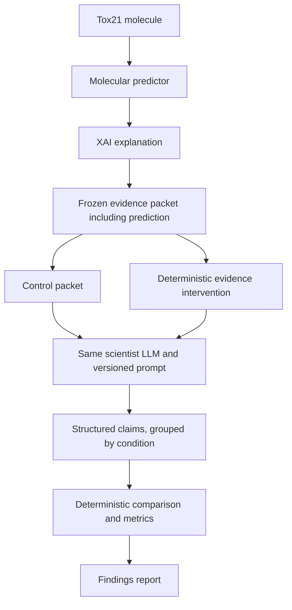

# Concordia

Concordia evaluates whether a scientist LLM remains faithful to molecular-model explanations under controlled XAI evidence corruption.

**Status: initial architecture and documentation only.** No molecular models, LLM integrations, evaluators, or experiments are implemented. This initial repository contains a project overview and a phased research plan.

## Why Concordia?

Scientific AI workflows can combine predictive ML models, explainable AI (XAI) evidence, and LLM-generated interpretations. A fluent scientific explanation may sound convincing even when the model evidence supplied to the LLM is incomplete or incorrect. Concordia is designed to measure how scientific claims respond to controlled changes in that evidence.

## Research Question

When an LLM receives a molecular prediction and its explanation, does it appropriately reduce or change its scientific claims when the explanation is withheld, shuffled, or corrupted—or does it rationalize the altered evidence?

## Core Idea

One scientist LLM interprets fixed evidence under multiple conditions. A deterministic evaluator compares its structured outputs.



Interventions modify the evidence before each independent LLM call. The evaluator only calculates comparison results; it does not generate explanations or feedback to the scientist.

## What Concordia Tests

| Condition | Evidence supplied |
| --- | --- |
| Control | Unmodified predictor output and corresponding XAI evidence |
| Explanation withheld | Same prediction, with XAI evidence removed |
| Explanation shuffled | Same prediction, with explanation evidence from another molecule |
| Explanation corrupted | Same prediction, with specified attribution values deterministically modified or inverted; a later extension |

The study will examine claim retention, additions and removals, confidence changes, and dependence on evidence references. A control explanation is authentic model evidence, not proof of a biological mechanism; a model prediction may itself be wrong.

## Why This Matters

Scientific reliability requires interpretations to reflect the strength and relevance of their evidence. Concordia asks: **Does the LLM's scientific reasoning appropriately respond when the explanatory evidence underneath it changes?** This goes beyond labeling an answer as a hallucination: stable prediction statements can be appropriate while unsupported mechanistic explanations should be qualified.

## Initial Experiment

The planned MVP uses Tox21, initially the NR-AhR assay, with approximately 30 held-out molecules for experimental evaluation. The predictor will train on a separate, larger training partition; the 30 molecules are not the training dataset.

- One baseline: RDKit Morgan fingerprints and a scikit-learn Random Forest.
- One explanation method: SHAP / TreeSHAP for the baseline's fingerprint features.
- Frozen packets containing molecule identity, prediction probability, assay, model identity, attribution evidence, and experiment metadata.
- Approximately eight curated supporting documents, with provenance and fixed excerpts.
- One scientist LLM accessed through a direct provider API with structured outputs.
- Control, explanation-withheld, and explanation-shuffled conditions, with repeated calls where useful to estimate variability.
- Deterministic comparisons, manual scientific scoring where necessary, and a reproducible findings report.

No results are available. Deterministic corruption follows the minimal experiment once the initial conditions work.

## Architecture

| Component | Future responsibility |
| --- | --- |
| Predictor | Produce an assay-specific prediction and probability from a validated molecule. |
| Explanation engine | Generate existing XAI attributions for the fixed predictor and input. |
| Evidence packet builder | Freeze prediction, explanation, document excerpts, identifiers, and provenance for replay. |
| Scientist LLM | Interpret one supplied packet and return structured scientific claims. |
| Intervention engine | Transform only designated evidence fields and record the transformation. |
| Claim parser | Validate the response contract using Pydantic; preserve invalid raw responses and validation failures. |
| Deterministic evaluator | Compare validated claims using fixed rules and, where needed, separately supplied human annotations. |
| Reporting layer | Summarize metrics, uncertainty, and examples in reproducible reports. |

Future modules will follow `predictors`, `explanations`, `evidence`, `scientist`, `interventions`, `evaluation`, and `reporting`. Claim parsing belongs to the scientist interface. Exact packet and claim schemas are deferred; planned claim concepts include claim text, type, confidence, evidence reference, evidence strength, and relationship to the prediction.

## Example Experiment

Consider a real Tox21 molecule selected later as Molecule A and an eligible donor Molecule B. This is a conceptual protocol, not an experimental result:

| Run | Input |
| --- | --- |
| Control | A's unchanged prediction plus A's original explanation |
| Withheld | A's unchanged prediction with no explanation |
| Shuffled | A's unchanged prediction plus B's explanation |

Each independent call returns the same structured claim contract. The evaluator compares claim membership, confidence, and cited evidence against A's control output. It records the donor mapping separately for audit; it does not provide control responses or intervention labels to the scientist.

## Evaluation

Planned dimensions include claim retention, addition and removal; confidence shifts; evidence-reference changes; unsupported claim and contradiction rates; and explanation/intervention sensitivity. Claim matching rules, denominators, missing-output handling, and confidence scales must be fixed before the main experiment.

Deterministic reference checks can establish whether a cited evidence item exists, but cannot establish all scientific entailment. Semantic support and contradictions will use predefined human annotation rules where mechanical checks are insufficient. The evaluator will aggregate those annotations without introducing another reasoning LLM. Sensitivity alone is not success: interpretation must consider which claims should change and which remain supported by the unchanged prediction.

## Reproducibility

The planned contract records dataset source/version and checksum, molecule identifiers and canonicalization policy, split membership, seeds, predictor artifact identity, fingerprint settings, XAI configuration, document versions, prompt version, LLM model identifier, generation parameters, and intervention identifiers. Content-hashed packets and immutable experiment manifests link these inputs to saved raw responses, validation records, and derived results.

Randomness in data splitting, training, explanation generation, donor selection, and repeated LLM calls will be recorded separately. Hosted LLM calls may remain nondeterministic despite fixed parameters; saved responses enable exact evaluation replay, while new calls measure generation variability. Credentials and large artifacts remain outside Git; shareable manifests and artifact checksums remain version-controlled.

## Technology

### MVP / baseline

Planned: Python, RDKit, MoleculeNet / Tox21, Morgan fingerprints, scikit-learn Random Forest, SHAP / TreeSHAP, a direct LLM provider API, structured outputs, and Pydantic. Analysis may use NumPy, pandas or Polars, and SciPy as needed. Optional experiment tracking will select either MLflow or Weights & Biases only if useful.

### Later extension

Chemprop v2, PyTorch, and Integrated Gradients / Captum will be considered after the baseline evaluation framework works. These tools are not implemented or installed by this setup.

## Repository Structure

```text
concordia/
├── README.md          Project scope, architecture, and planned experiment
├── LICENSE            MIT license
├── .gitignore         Local files and generated artifact exclusions
└── docs/
    └── ROADMAP.md     Phased deliverables and completion criteria
```

The existing roadmap location is retained. The broader source, configuration, data, experiment, report, and test skeleton is deferred in keeping with this initial documentation-only scope.

## Roadmap

[The detailed roadmap](docs/ROADMAP.md) progresses from foundation through baseline prediction, XAI evidence, scientist interface, interventions, deterministic evaluation, the small experiment, and findings. A stronger predictor and static HTML presentation follow the baseline study.

## Current Status

This stage establishes architecture, project boundaries, reproducibility design, and experiment structure in documentation. Implementation starts in a later stage. There are no measured performance or robustness claims.

## Non-Goals

Concordia is not a multi-agent debate framework, autonomous scientist, new XAI algorithm, production toxicity prediction platform, generic RAG chatbot, or general hallucination benchmark. It uses one scientist LLM with deterministic evaluation infrastructure. No advocate, skeptic, judge, or self-correction agents are planned. Static reports are preferred; no frontend framework, service architecture, or database is needed for the MVP.

## License

Available under the [MIT License](LICENSE). External datasets, documents, and model artifacts retain their own licenses.
