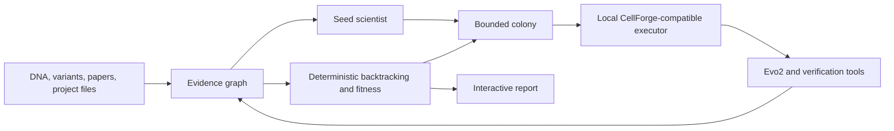

# Concordia Colony

Concordia Colony is a provenance-first scientific platform for testing, tracing, and improving explanations produced around genomic foundation models.

One seed scientist creates a bounded colony of isolated workflow variants. Each descendant inherits a versioned digital genome, uses approved computational biology tools inside a sandbox, and produces structured claims. Deterministic infrastructure verifies evidence paths, calculates fitness, selects surviving workflows, and records the complete lineage.

> **Current status:** the repository contains a working molecular evidence baseline, genomic evidence contracts, durable local orchestration, provenance-aware project ingestion, a local CellForge-compatible boundary, qualified local and free-hosted seed runtimes, bounded colony evolution, independent evidence verification, and a built interactive workspace. The local demonstration needs neither an external CellForge service nor Evo2 hardware. A two-variant HBB pilot protocol is frozen. NVIDIA hosted access has been validated for generation only, while hosted forward scoring fails closed; no real Evo2 score or genomic finding is claimed.

## Problem

Genomic foundation models can assign scores or attribution signals to DNA sequences, but an attribution map does not establish that a highlighted region is causal, stable, or biologically meaningful. Researchers need to know:

- which input, model, checkpoint, and method produced an explanation;
- whether the explanation agrees with controlled sequence perturbations;
- whether it remains stable across windows, references, and repeated runs;
- whether independent biological or model evidence supports it;
- which scientific claims depend on which evidence;
- and whether the full analysis can be inspected and replayed.

Concordia Colony turns those questions into an auditable computational workflow.

## Product

A researcher supplies a genomic region, variant, declared task, model configuration, and optional project files. Concordia builds an evidence graph, executes approved verification tools, and returns model artifacts, counterfactual results, structured claims, supporting and contradictory evidence, verification metrics, workflow lineage, and a reproducible manifest.

The output is a testable, evidence-traceable hypothesis or audit result—not a declaration of biological truth.

Real-study admission is gated by a frozen `StudyProtocol`. The protocol records licensing, cohort criteria, model target, genomic coordinates, evidence families, hypotheses, and uncertainty analysis before outcomes are imported. Fixture, synthetic, and ineligible model outputs are rejected by the gate.

## System Overview



The implemented local adapter owns process-isolated execution of trusted, registered tools. Its contracts are designed so an external CellForge runtime can replace it later. Concordia owns run orchestration, digital genomes, evidence lineage, structured claims, deterministic verification, colony selection, and reporting.

## Digital Evolution

The colony is a controlled search over scientific workflows rather than a group discussion.

| Biological concept | Concordia representation |
| --- | --- |
| Genome | Versioned prompt, workflow, tool policy, attribution settings, and budgets |
| Mutation | One recorded change to a permitted genome field |
| Organism | One isolated workflow execution |
| Phenotype | Tool trace, artifacts, claims, and verification results |
| Environment | Frozen biological task and evidence |
| Fitness | Deterministic evidence, stability, reproducibility, and resource metrics |
| Selection | Recorded survivor selection from declared metric components |
| Extinction | A terminal lineage that failed validation, policy, or selection |

Descendants cannot communicate, inspect competing answers, edit policy, rewrite fitness rules, or create unrestricted tools. The orchestrator controls reproduction. The evaluator does not use another language model to judge scientific truth.

## Evidence Graph and Backtracking

Concordia connects a scientific graph to a provenance graph. Scientific nodes include sequences, variants, assays, models, predictions, attributions, motifs, annotations, papers, and claims. Provenance nodes include source files, source spans, parser runs, tool executions, artifacts, prompts, model turns, digital genomes, colony members, mutations, verification checks, and fitness records.

Every accepted assertion records its source, version, generating activity, input hashes, output hash, and validation state. A claim can be followed through the system:

```text
Claim
  → evidence assertion
  → source span or artifact
  → attribution region
  → sequence locus
  → counterfactual mutation
  → model score delta
  → model checkpoint and input
```

Fixture-backed paths remain visible but cannot receive scientific support status.

### Project ingestion

The `ingest-project` command deterministically parses supported repository files and stores the resulting evidence graph as a content-addressed artifact. Implemented parsers cover Markdown headings, Python class and function definitions, YAML, JSON, CSV metadata rows, experiment manifests, XAI records, and paper metadata.

Every extracted entity records its repository-relative path, source digest, parser version, exact line and character span, extraction method, confidence, and validation status. Accepted assertions and rejected candidates both remain in the graph. Changed files create append-only `wasRevisionOf` chains; unchanged re-ingestion produces the same graph identity.

## Cross-Verification

The deterministic verifier now checks independent evidence families, artifact integrity across every provenance branch, counterfactual requirements, contradictions, and exact model/assay scope. See [verification contracts](docs/verification.md) and [Evo 2 reading and future scope](docs/evo2-reading.md).

Evidence is grouped by method family so several related attribution algorithms are not mistaken for independent confirmation. Planned families include:

1. Counterfactual evidence from controlled in-silico mutagenesis.
2. Gradient or attribution evidence for a declared model output.
3. Biological annotations such as motifs, accessibility, binding, or conservation.
4. Cross-model evidence from a compatible independently trained model.
5. Literature evidence preserved with exact source provenance.

Agreement increases confidence only within the declared model and assay scope. It does not establish biological causality. Verification statuses are `SUPPORTED`, `PARTIALLY_SUPPORTED`, `CONTRADICTED`, `UNVERIFIABLE`, and `MISSING_EVIDENCE`.

## Backend Direction

The target is a modular monolith with isolated workers:

- FastAPI control plane with typed OpenAPI contracts;
- idempotent commands and explicit run state transitions;
- append-only SQLite event ledger;
- worker leases, cancellation, bounded retries, and crash recovery;
- DuckDB and Parquet evidence-graph projections;
- SHA-256 content-addressed artifact storage;
- versioned tool registry and policy engine;
- local CellForge-compatible execution adapter;
- Server-Sent Events for live progress;
- deterministic fitness, lineage, and replay services;
- structured logs and local resource accounting.

Cloud schedulers and object stores may be added as replaceable adapters. They are not required for local development or the portfolio demonstration.

### Implemented durable backend

The local backend persists genomic fixture runs in an append-only SQLite ledger and schedules them for isolated local workers. It provides explicit validated states, monotonic per-run event sequences, optimistic append checks, idempotent creation, event replay, restart recovery, content-addressed artifact references, cursor-based event pagination, structured API errors, typed OpenAPI contracts, expiring worker leases, heartbeats, stale-lease recovery, bounded infrastructure retries, cancellation, and reconnectable Server-Sent Events.

The working path is:

```text
create run → persist genomic input → schedule durable job → claim worker lease
→ execute fixture scoring
→ persist score, mutational scan, evidence graph, and verification artifacts
→ reconstruct the completed run from events
```

The fixture scorer remains software-only, and every artifact produced by this path has `scientific_use_allowed=false`. Only explicitly classified infrastructure failures are retried; validation, artifact, model, policy, and scientific-tool failures are preserved without automatic reruns.

### Implemented scientific tool boundary

Concordia includes immutable execution contracts, a versioned registry, deny-by-default policies, per-tool resource budgets, and a local child-process adapter. The initial registered tools are `sequence.validate`, `variant.normalize`, `artifact.verify`, `graph.query`, `lineage.backtrack`, `evidence.verify`, and `xai.mutational_scan`. Requests cannot name arbitrary shell commands or Python code. Network access is denied, repository paths are allowlisted and checked against traversal and symlink escape, timeouts terminate child processes, and bounded partial logs survive failures.

Every integrated tool call records its exact request and result in the event ledger, stores its result in content-addressed storage, and emits a small provenance graph joining the tool run to the artifact. This local boundary executes trusted in-process handlers in a separate process; it is not a hardened container or a substitute for an external CellForge deployment when hostile code must run. All current genomic tool outputs are fixture-backed or deterministic software checks and remain ineligible for scientific conclusions. See [the execution-boundary documentation](docs/cellforge.md).

### Local seed scientist and qualification

The genomic seed runtime now accepts four typed turns, preserves prompts and raw responses, validates evidence references, and routes bounded tool requests through the local executor. Each session starts with fresh messages. Model-proposed claims have no verification-status field; deterministic infrastructure retains that responsibility. Ollama remains the local default. An optional OpenRouter adapter accepts only `openrouter/free` or explicit `:free` models, records the resolved model identity, and never acts as the scientific verifier.

`concordia qualify-scientist --model MODEL --repetitions 2` runs installed Ollama candidates against a frozen software fixture and stores separate validity, tool-use, reference, stability, latency, token, and memory measurements. Set `OLLAMA_NO_CLOUD=1`. Completed executions can be replayed without inference. See [the runtime and qualification guide](docs/seed-scientist.md).

Phase 5 is complete for the local software fixture. After preserving failed `phi3:latest` and `gemma3:270m` attempts, `qwen3:1.7b` passed the versioned two-repetition protocol and is pinned by checkpoint digest. Both accepted repetitions produced valid JSON, successful graph requests, schema-valid scoped claims, correct evidence references, and identical final responses. These qualification measurements establish protocol compatibility only; they are not genomic findings or evidence of biological judgment.

### Bounded colony evolution

Phase 6 implements immutable versioned digital genomes, eight allowlisted single-field mutation operators, complete mutation records, a generation barrier, bounded sequential or local concurrent execution, cancellation, restart recovery, member-budget and stagnation stops, extinction records, and deterministic survivor selection. Each worker receives only its own genome, isolation identity, and the same frozen task artifact; peer claims and outputs are absent from the worker contract.

Fitness retains all declared scientific-quality, reliability, penalty, runtime, token, and compute components. The documented `weighted-fitness-v1` calculation and identifier tie-break make selection reproducible from saved member-output artifacts. The deterministic executor remains available for replay. A measured local-scientist executor now runs one fresh Ollama session per member and derives fitness only from saved protocol measurements. A three-member `qwen3:1.7b` software run completed with valid schemas, references, and tool calls; its scientific components remained zero because the task was a fixture. See [the colony documentation](docs/colonies.md).

## Interactive Workspace

The React and TypeScript workspace opens directly into a saved active scientific run and provides:

- a WebGL colony lineage graph with generation replay;
- a knowledge and provenance graph with semantic zoom;
- claim backtracking that illuminates complete evidence paths;
- genomic sequence, variant, attribution, motif, and mutational-scan tracks;
- parent-versus-descendant and method-versus-method comparisons;
- a cross-verification matrix and live execution stream;
- immutable artifact, genome, and policy inspectors;
- and clear visualization of failed or extinct lineages.

Scientific views must be rendered from saved artifacts and clearly distinguish demonstrations from measured results.

## Current Implementation

### Molecular evidence baseline

The original track demonstrates the evidence-intervention pattern with real Tox21 NR-AhR data:

- RDKit validation, canonicalization, and duplicate handling;
- deterministic scaffold-aware splitting;
- Morgan fingerprints and Random Forest prediction;
- validated TreeSHAP artifacts and content-hashed evidence packets;
- withheld, shuffled, and deterministic corruption transforms;
- structured scientist claims and deterministic comparison rules.

This track remains a molecular proof of the framework. Its results must not be combined with genomic results.

### Genomic evidence vertical slice

The zero-cost genomic slice implements:

- validated DNA and variant contracts;
- reference-allele and coordinate checks;
- an Evo2-compatible scoring boundary;
- an explicitly labeled recorded-fixture scorer;
- deterministic position-level in-silico mutagenesis;
- content-addressed artifact storage;
- validated evidence-graph nodes and edges;
- shortest-path claim backtracking;
- and rejection of fixture-backed paths as scientific evidence.

The recorded fixture validates software behavior only. It is not an Evo2 result.

### Real-study and virtual-cell boundaries

The frozen HBB promoter pilot files under `configs/studies/` pin two ClinVar variants, exact GRCh38 coordinates, 8,192-base Ensembl window hashes, cohort rules, data-use terms, checkpoint, scoring target, evidence families, hypothesis, and uncertainty policy before any Evo2 outcome is inspected. NVIDIA's free hosted Evo2 surface currently documents generation, not the `/forward` tensors required by that protocol. Concordia therefore offers a non-scientific hosted-generation smoke test and fails closed for hosted forward scoring. A measured synthetic-input call passed the generation contract; its exact artifact identities and limitations are preserved in [`reports/nvidia-evo2-hosted-smoke.json`](reports/nvidia-evo2-hosted-smoke.json). Real study scoring still requires a verified local Evo2 NIM or another documented forward adapter. Credentials are read only from `NVIDIA_API_KEY`.

Arc State is a separate single-cell perturbation domain. Concordia has a persist-first virtual-cell sandbox contract, bounded CELLxGENE ingestion, and a separately selected K562 release from `arcinstitute/ST-HVG-Replogle`. The selected checkpoint and matched 188,590-cell by 2,000-gene H5AD are pinned by revision, byte size, digest, and schema. The user accepted the applicable terms for non-commercial use on 10 September 2026; the historical source-code verification record remains `NOT_ACCEPTED` because it did not record that later release decision. Verification never deserializes the checkpoint or helper files, and no State prediction has been run. See [the State boundary](docs/state-sandbox.md).

## Local Quickstart

```bash
uv sync --extra dev --extra xai --extra scientist --extra virtual-cell
.venv/bin/pytest
.venv/bin/ruff check src tests
.venv/bin/concordia genomic-demo
.venv/bin/concordia ingest-project
.venv/bin/concordia list-tools
.venv/bin/concordia colony-demo
.venv/bin/concordia qwen-colony-demo
.venv/bin/concordia cellxgene-state-demo
.venv/bin/concordia verify-state-release --root .concordia/external/state-k562
.venv/bin/concordia verify-evo2-source --checkout .concordia/external/evo2-source
NVIDIA_API_KEY=... .venv/bin/concordia nvidia-evo2-smoke --sequence ACGTACGT
.venv/bin/concordia serve-workspace
.venv/bin/mypy src/concordia
(cd frontend && npm test)
```

Start the local control plane on the loopback interface:

```bash
.venv/bin/concordia serve-api
```

Run the local worker in another terminal:

```bash
.venv/bin/concordia run-worker
```

The interactive saved workspace is served on port 7860 by `serve-workspace` and opens directly into claims, lineage, provenance, sequence/counterfactual tracks, artifacts, and event replay. It is read-only fixture mode. The CPU Docker image and Hugging Face Space upload procedure are documented in [docs/deployment.md](docs/deployment.md).

Then create a durable fixture run:

```bash
curl -X POST http://127.0.0.1:8000/runs \
  -H 'Content-Type: application/json' \
  -d '{
    "idempotency_key": "demo-run-1",
    "sequence": {
      "sequence_id": "fixture:demo",
      "sequence": "ACGTTGCAACGT",
      "assembly": "GRCh38",
      "region": "chr1:0-12",
      "strand": "+"
    },
    "scan_position": 4
  }'
```

`POST /runs` persists and schedules the run; it does not execute scientific work inside the request process. Local state is written beneath `.concordia/` and is ignored by Git. API schemas are available at `http://127.0.0.1:8000/docs`, and live events are available at `GET /runs/{run_id}/stream` with `Last-Event-ID` reconnection.

Run the molecular baseline:

```bash
.venv/bin/concordia download
.venv/bin/concordia train-baseline
.venv/bin/concordia explain \
  --model artifacts/baseline_nr_ahr/model.joblib \
  --molecules artifacts/baseline_nr_ahr/molecules.csv \
  --output artifacts/tree_shap
```

Check the local scientist runtime without downloading a model:

```bash
OLLAMA_NO_CLOUD=1 .venv/bin/concordia doctor
```

Generated datasets, models, raw responses, and bulk artifacts stay outside Git. Small manifests, schemas, prompts, documentation, and permitted reports remain version controlled.

## Zero-Cost Constraint

The portfolio version must be developable without paid infrastructure. It uses SQLite, DuckDB, Parquet, the local filesystem, local model runtimes, CellForge, and open-source visualization libraries. GPU-dependent tools must degrade gracefully. Recorded fixtures may validate software interfaces but cannot support scientific conclusions.

Real local Evo2 forward inference requires supported NVIDIA hardware and substantial model storage. Real Evo2 experiments remain behind an adapter until compatible compute is available.

## Roadmap

1. **Evidence graph vertical slice:** complete for the current software fixture.
2. **Durable backend:** complete for the local fixture scope; the event ledger, worker leases, recovery, cancellation, replay, artifact APIs, and live events are implemented.
3. **Project ingestion:** complete for deterministic local text and metadata parsing with immutable provenance graphs and source revision history.
4. **CellForge tools:** typed sandbox execution and event/graph integration.
5. **Colony evolution:** digital genomes, controlled mutations, deterministic fitness, selection, and lineage.
6. **Cross-verification:** independent evidence families, contradictions, and stability checks.
7. **Scientific validation:** a frozen regulatory-variant task using real model outputs and real biological evidence.
8. **Interactive presentation:** the lineage, evidence, sequence, comparison, and artifact workspace.

See the [detailed roadmap](docs/ROADMAP.md), [architecture](docs/architecture.md), [experiment design](docs/experiment-design.md), and [reproducibility contract](docs/reproducibility.md).

## Scientific Boundaries

Concordia Colony is not a clinical decision system, a causal-inference engine, or a source of experimental validation. Foundation-model scores, attribution values, method agreement, and literature support are evidence with limitations. They are not substitutes for biological experiments.

## License

Available under the [MIT License](LICENSE). External datasets, documents, model artifacts, and annotations retain their own licenses.
