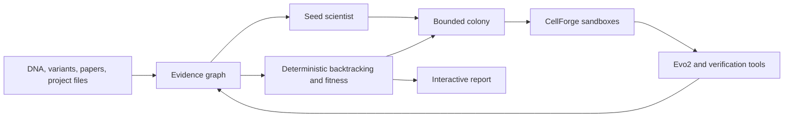

# Concordia Colony

Concordia Colony is a provenance-first scientific platform for testing, tracing, and improving explanations produced around genomic foundation models.

One seed scientist creates a bounded colony of isolated workflow variants. Each descendant inherits a versioned digital genome, uses approved computational biology tools inside a sandbox, and produces structured claims. Deterministic infrastructure verifies evidence paths, calculates fitness, selects surviving workflows, and records the complete lineage.

> **Current status:** the repository contains a working molecular evidence baseline and the first zero-cost genomic evidence vertical slice. Colony scheduling, durable APIs, real Evo2 execution, cross-method validation, and the interactive frontend are planned. No genomic or scientist-model research result is claimed.

## Problem

Genomic foundation models can assign scores or attribution signals to DNA sequences, but an attribution map does not establish that a highlighted region is causal, stable, or biologically meaningful. Researchers need to know:

- which input, model, checkpoint, and method produced an explanation;
- whether the explanation agrees with controlled sequence perturbations;
- whether it remains stable across windows, references, and repeated runs;
- whether independent biological or model evidence supports it;
- which scientific claims depend on which evidence;
- and whether the full analysis can be inspected and replayed.

Concordia Colony turns those questions into an auditable computational workflow.

## Product

A researcher supplies a genomic region, variant, declared task, model configuration, and optional project files. Concordia builds an evidence graph, executes approved verification tools, and returns model artifacts, counterfactual results, structured claims, supporting and contradictory evidence, verification metrics, workflow lineage, and a reproducible manifest.

The output is a testable, evidence-traceable hypothesis or audit result—not a declaration of biological truth.

## System Overview



CellForge owns isolated tool execution. Concordia owns run orchestration, digital genomes, evidence lineage, structured claims, deterministic verification, colony selection, and reporting.

## Digital Evolution

The colony is a controlled search over scientific workflows rather than a group discussion.

| Biological concept | Concordia representation |
| --- | --- |
| Genome | Versioned prompt, workflow, tool policy, attribution settings, and budgets |
| Mutation | One recorded change to a permitted genome field |
| Organism | One isolated workflow execution |
| Phenotype | Tool trace, artifacts, claims, and verification results |
| Environment | Frozen biological task and evidence |
| Fitness | Deterministic evidence, stability, reproducibility, and resource metrics |
| Selection | Recorded survivor selection from declared metric components |
| Extinction | A terminal lineage that failed validation, policy, or selection |

Descendants cannot communicate, inspect competing answers, edit policy, rewrite fitness rules, or create unrestricted tools. The orchestrator controls reproduction. The evaluator does not use another language model to judge scientific truth.

## Evidence Graph and Backtracking

Concordia connects a scientific graph to a provenance graph. Scientific nodes include sequences, variants, assays, models, predictions, attributions, motifs, annotations, papers, and claims. Provenance nodes include source files, source spans, parser runs, tool executions, artifacts, prompts, model turns, digital genomes, colony members, mutations, verification checks, and fitness records.

Every accepted assertion records its source, version, generating activity, input hashes, output hash, and validation state. A claim can be followed through the system:

```text
Claim
  → evidence assertion
  → source span or artifact
  → attribution region
  → sequence locus
  → counterfactual mutation
  → model score delta
  → model checkpoint and input
```

Fixture-backed paths remain visible but cannot receive scientific support status.

## Cross-Verification

Evidence is grouped by method family so several related attribution algorithms are not mistaken for independent confirmation. Planned families include:

1. Counterfactual evidence from controlled in-silico mutagenesis.
2. Gradient or attribution evidence for a declared model output.
3. Biological annotations such as motifs, accessibility, binding, or conservation.
4. Cross-model evidence from a compatible independently trained model.
5. Literature evidence preserved with exact source provenance.

Agreement increases confidence only within the declared model and assay scope. It does not establish biological causality. Verification statuses are `SUPPORTED`, `PARTIALLY_SUPPORTED`, `CONTRADICTED`, `UNVERIFIABLE`, and `MISSING_EVIDENCE`.

## Backend Direction

The target is a modular monolith with isolated workers:

- FastAPI control plane with typed OpenAPI contracts;
- idempotent commands and explicit run state transitions;
- append-only SQLite event ledger;
- worker leases, cancellation, bounded retries, and crash recovery;
- DuckDB and Parquet evidence-graph projections;
- SHA-256 content-addressed artifact storage;
- versioned tool registry and policy engine;
- CellForge execution adapter;
- Server-Sent Events for live progress;
- deterministic fitness, lineage, and replay services;
- structured logs and local resource accounting.

Cloud schedulers and object stores may be added as replaceable adapters. They are not required for local development or the portfolio demonstration.

## Interactive Workspace

The planned React and TypeScript workspace will open directly into an active scientific run and provide:

- a WebGL colony lineage graph with generation replay;
- a knowledge and provenance graph with semantic zoom;
- claim backtracking that illuminates complete evidence paths;
- genomic sequence, variant, attribution, motif, and mutational-scan tracks;
- parent-versus-descendant and method-versus-method comparisons;
- a cross-verification matrix and live execution stream;
- immutable artifact, genome, and policy inspectors;
- and clear visualization of failed or extinct lineages.

Scientific views must be rendered from saved artifacts and clearly distinguish demonstrations from measured results.

## Current Implementation

### Molecular evidence baseline

The original track demonstrates the evidence-intervention pattern with real Tox21 NR-AhR data:

- RDKit validation, canonicalization, and duplicate handling;
- deterministic scaffold-aware splitting;
- Morgan fingerprints and Random Forest prediction;
- validated TreeSHAP artifacts and content-hashed evidence packets;
- withheld, shuffled, and deterministic corruption transforms;
- structured scientist claims and deterministic comparison rules.

This track remains a molecular proof of the framework. Its results must not be combined with genomic results.

### Genomic evidence vertical slice

The zero-cost genomic slice implements:

- validated DNA and variant contracts;
- reference-allele and coordinate checks;
- an Evo2-compatible scoring boundary;
- an explicitly labeled recorded-fixture scorer;
- deterministic position-level in-silico mutagenesis;
- content-addressed artifact storage;
- validated evidence-graph nodes and edges;
- shortest-path claim backtracking;
- and rejection of fixture-backed paths as scientific evidence.

The recorded fixture validates software behavior only. It is not an Evo2 result.

## Local Quickstart

```bash
uv sync --extra dev --extra xai --extra scientist
.venv/bin/pytest
.venv/bin/ruff check src tests
.venv/bin/concordia genomic-demo
```

Run the molecular baseline:

```bash
.venv/bin/concordia download
.venv/bin/concordia train-baseline
.venv/bin/concordia explain \
  --model artifacts/baseline_nr_ahr/model.joblib \
  --molecules artifacts/baseline_nr_ahr/molecules.csv \
  --output artifacts/tree_shap
```

Check the local scientist runtime without downloading a model:

```bash
OLLAMA_NO_CLOUD=1 .venv/bin/concordia doctor
```

Generated datasets, models, raw responses, and bulk artifacts stay outside Git. Small manifests, schemas, prompts, documentation, and permitted reports remain version controlled.

## Zero-Cost Constraint

The portfolio version must be developable without paid infrastructure. It uses SQLite, DuckDB, Parquet, the local filesystem, local model runtimes, CellForge, and open-source visualization libraries. GPU-dependent tools must degrade gracefully. Recorded fixtures may validate software interfaces but cannot support scientific conclusions.

Real local Evo2 forward inference requires supported NVIDIA hardware and substantial model storage. Real Evo2 experiments remain behind an adapter until compatible compute is available.

## Roadmap

1. **Evidence graph vertical slice:** complete for the current software fixture.
2. **Durable backend:** state machine, event ledger, leases, replay, graph APIs, and live events.
3. **Colony evolution:** digital genomes, controlled mutations, deterministic fitness, selection, and lineage.
4. **Cross-verification:** independent evidence families, contradictions, and stability checks.
5. **Scientific validation:** a frozen regulatory-variant task using real model outputs and real biological evidence.
6. **Interactive presentation:** the lineage, evidence, sequence, comparison, and artifact workspace.

See the [detailed roadmap](docs/ROADMAP.md), [architecture](docs/architecture.md), [experiment design](docs/experiment-design.md), and [reproducibility contract](docs/reproducibility.md).

## Scientific Boundaries

Concordia Colony is not a clinical decision system, a causal-inference engine, or a source of experimental validation. Foundation-model scores, attribution values, method agreement, and literature support are evidence with limitations. They are not substitutes for biological experiments.

## License

Available under the [MIT License](LICENSE). External datasets, documents, model artifacts, and annotations retain their own licenses.
