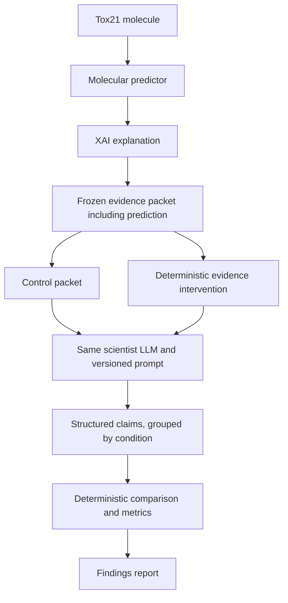

# Concordia

Concordia evaluates whether a scientist LLM remains faithful to molecular-model explanations under controlled XAI evidence corruption.

**Status: Phases 0–2 are complete and Phase 3 is in development.** The repository contains reproducible Tox21/NR-AhR preparation, scaffold splitting, Morgan fingerprints, a Random Forest baseline, validated TreeSHAP development artifacts, frozen packet manifests, a local structured scientist interface, tests, and the research design for the later intervention study. No LLM robustness result is claimed yet.

## Why Concordia?

Scientific AI workflows can combine predictive ML models, explainable AI (XAI) evidence, and LLM-generated interpretations. A fluent scientific explanation may sound convincing even when the model evidence supplied to the LLM is incomplete or incorrect. Concordia is designed to measure how scientific claims respond to controlled changes in that evidence.

## Research Question

When an LLM receives a molecular prediction and its explanation, does it appropriately reduce or change its scientific claims when the explanation is withheld, shuffled, or corrupted—or does it rationalize the altered evidence?

## Core Idea

One scientist LLM interprets fixed evidence under multiple conditions. A deterministic evaluator compares its structured outputs.



Interventions modify the evidence before each independent LLM call. The evaluator only calculates comparison results; it does not generate explanations or feedback to the scientist.

## What Concordia Tests

| Condition | Evidence supplied |
| --- | --- |
| Control | Unmodified predictor output and corresponding XAI evidence |
| Explanation withheld | Same prediction, with XAI evidence removed |
| Explanation shuffled | Same prediction, with explanation evidence from another molecule |
| Explanation corrupted | Same prediction, with specified attribution values deterministically modified or inverted; a later extension |

The study will examine claim retention, additions and removals, confidence changes, and dependence on evidence references. A control explanation is authentic model evidence, not proof of a biological mechanism; a model prediction may itself be wrong.

## Why This Matters

Scientific reliability requires interpretations to reflect the strength and relevance of their evidence. Concordia asks: **Does the LLM's scientific reasoning appropriately respond when the explanatory evidence underneath it changes?** This goes beyond labeling an answer as a hallucination: stable prediction statements can be appropriate while unsupported mechanistic explanations should be qualified.

## Initial Experiment

The planned MVP uses Tox21, initially the NR-AhR assay, with approximately 30 held-out molecules for experimental evaluation. The predictor will train on a separate, larger training partition; the 30 molecules are not the training dataset.

- One baseline: RDKit Morgan fingerprints and a scikit-learn Random Forest.
- One explanation method: SHAP / TreeSHAP for the baseline's fingerprint features.
- Frozen packets containing molecule identity, prediction probability, assay, model identity, attribution evidence, and experiment metadata.
- Approximately eight curated supporting documents, with provenance and fixed excerpts.
- One scientist LLM accessed through a local runtime with structured outputs; the first backend will be Ollama, with the runtime and model recorded in each manifest.
- Control, explanation-withheld, and explanation-shuffled conditions, with repeated calls where useful to estimate variability.
- Deterministic comparisons, manual scientific scoring where necessary, and a reproducible findings report.

The predictor baseline is implemented and has been run on the downloaded archive. TreeSHAP and packet generation now work for development subsets and validate checksums, dimensions, finiteness, and reconstruction error. The study cohort, scientist responses, and Concordia robustness results are not yet available. Deterministic corruption follows the minimal experiment once the initial conditions work.

## Architecture

| Component | Future responsibility |
| --- | --- |
| Predictor | Produce an assay-specific prediction and probability from a validated molecule. |
| Explanation engine | Generate existing XAI attributions for the fixed predictor and input. |
| Evidence packet builder | Freeze prediction, explanation, document excerpts, identifiers, and provenance for replay. |
| Scientist LLM | Interpret one supplied packet through one local, stateless model call and return structured scientific claims. |
| Intervention engine | Transform only designated evidence fields and record the transformation. |
| Claim parser | Validate the response contract using Pydantic; preserve invalid raw responses and validation failures. |
| Deterministic evaluator | Compare validated claims using fixed rules and, where needed, separately supplied human annotations. |
| Reporting layer | Summarize metrics, uncertainty, and examples in reproducible reports. |

Future modules will follow `predictors`, `explanations`, `evidence`, `scientist`, `interventions`, `evaluation`, and `reporting`. Claim parsing belongs to the scientist interface. Exact packet and claim schemas are deferred; planned claim concepts include claim text, type, confidence, evidence reference, evidence strength, and relationship to the prediction.

## Example Experiment

Consider a real Tox21 molecule selected later as Molecule A and an eligible donor Molecule B. This is a conceptual protocol, not an experimental result:

| Run | Input |
| --- | --- |
| Control | A's unchanged prediction plus A's original explanation |
| Withheld | A's unchanged prediction with no explanation |
| Shuffled | A's unchanged prediction plus B's explanation |

Each independent call returns the same structured claim contract. The evaluator compares claim membership, confidence, and cited evidence against A's control output. It records the donor mapping separately for audit; it does not provide control responses or intervention labels to the scientist.

## Evaluation

Planned dimensions include claim retention, addition and removal; confidence shifts; evidence-reference changes; unsupported claim and contradiction rates; and explanation/intervention sensitivity. Claim matching rules, denominators, missing-output handling, and confidence scales must be fixed before the main experiment.

Deterministic reference checks can establish whether a cited evidence item exists, but cannot establish all scientific entailment. Semantic support and contradictions will use predefined human annotation rules where mechanical checks are insufficient. The evaluator will aggregate those annotations without introducing another reasoning LLM. Sensitivity alone is not success: interpretation must consider which claims should change and which remain supported by the unchanged prediction.

## Reproducibility

The planned contract records dataset source/version and checksum, molecule identifiers and canonicalization policy, split membership, seeds, predictor artifact identity, fingerprint settings, XAI configuration, document versions, prompt version, LLM model identifier, generation parameters, and intervention identifiers. Content-hashed packets and immutable experiment manifests link these inputs to saved raw responses, validation records, and derived results.

Randomness in data splitting, training, explanation generation, donor selection, and repeated LLM calls will be recorded separately. Hosted LLM calls may remain nondeterministic despite fixed parameters; saved responses enable exact evaluation replay, while new calls measure generation variability. Credentials and large artifacts remain outside Git; shareable manifests and artifact checksums remain version-controlled.

## Technology

### MVP / baseline

Planned and partially implemented: Python, RDKit, MoleculeNet / Tox21, Morgan fingerprints, scikit-learn Random Forest, SHAP / TreeSHAP, a local Ollama runtime, JSON Schema, and Pydantic. Analysis uses NumPy and pandas initially and may add SciPy or DuckDB for larger reports. No hosted tracking service is required.

### Later extension

Chemprop v2, PyTorch, and Integrated Gradients / Captum will be considered after the baseline evaluation framework works. These tools are not implemented or installed by this setup.

An optional post-MVP study may test framework generalization on a real genomic task using Evo 2 local forward outputs. Because Evo 2 consumes DNA rather than molecular SMILES, it is a separate research extension rather than part of the Tox21 predictor stack. It requires a validated genomic task, an established attribution method, and suitable FP8 hardware.

## Repository Structure

```text
concordia/
├── configs/           Versioned experiment configuration
├── data/              External, processed, and frozen evidence locations
├── experiments/       Run manifests and ignored bulk outputs
├── reports/           Shareable static reports
├── src/concordia/     Predictor and future scientist/evaluation modules
├── tests/              Unit and integration checks
├── README.md          Project scope and usage
└── docs/              Architecture, design, reproducibility, and roadmap
```

Large datasets, model binaries, raw responses, and generated artifacts are kept out of Git; manifests and checksums remain reviewable.

## Try the local demo

The demo requires no dataset, model weights, credentials, or network access.
From the repository root, run:

    uv sync
    .venv/bin/concordia demo
    open reports/demo.html

For the real baseline, download the configured Tox21 archive and run:

    .venv/bin/concordia download
    .venv/bin/concordia train-baseline

The model and data remain local. The baseline command writes ignored artifacts
under artifacts/; its manifest records checksums and environment metadata.

Before a local scientist run, check the runtime with `OLLAMA_NO_CLOUD=1 concordia doctor`. This command only inspects the local Ollama installation; it does not download a model or contact a hosted service. The MVP scientist receives frozen packets directly and has no tool access during evaluation.

## Roadmap

[The detailed roadmap](docs/ROADMAP.md) progresses from foundation through baseline prediction, XAI evidence, scientist interface, interventions, deterministic evaluation, the small experiment, and findings. A stronger predictor and static HTML presentation follow the baseline study.

## Current Status

Phase 0 established architecture, project boundaries, reproducibility design, and experiment structure. Phase 1 provides a tested baseline predictor and a real-data audit. Phase 2 provides validated TreeSHAP and packet-manifest tooling for development artifacts. Phase 3 now provides a local structured scientist adapter and content-hashed response records. The central LLM robustness experiment begins after the approximately 30-molecule cohort and evidence set are frozen. There are no measured Concordia robustness findings.

## Non-Goals

Concordia is not a multi-agent debate framework, autonomous scientist, new XAI algorithm, production toxicity prediction platform, generic RAG chatbot, or general hallucination benchmark. It uses one scientist LLM with deterministic evaluation infrastructure. No advocate, skeptic, judge, or self-correction agents are planned. Tool-enabled research mode is a separate ablation and cannot contribute evidence to the packet-only MVP. Static reports are preferred; no frontend framework, service architecture, or database is needed for the MVP.

## License

Available under the [MIT License](LICENSE). External datasets, documents, and model artifacts retain their own licenses.
