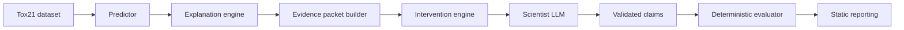

# Architecture

Concordia is organized as a linear, artifact-producing research pipeline. Each boundary has one responsibility and a serializable output. This makes every downstream experiment replayable without silently retraining a model, regenerating an explanation, or retrieving different context.

## Component boundaries

### Predictors

Own molecule validation, featurization, model fitting, prediction, and predictor artifact metadata. The baseline uses Morgan fingerprints and a Random Forest. Predictor outputs contain no scientific interpretation.

### Explanations

Generate model-specific attributions from a frozen predictor. The baseline will use TreeSHAP. Explanations must identify the predicted output being explained, the representation, attribution settings, expected value, feature ordering, and known limits such as fingerprint collisions.

### Evidence

Assemble immutable packets from molecule metadata, predictor output, explanation artifacts, fixed document excerpts, and provenance. Packet serialization must be canonical and content hashed. This boundary prevents live retrieval or changing model outputs from contaminating comparisons.

### Interventions

Apply one deterministic transformation to an evidence packet. An intervention returns a new packet and an audit record identifying its parent, transformation version, parameters, and donor when applicable. It may not alter unrelated fields.

### Scientist

Render a versioned prompt, call one LLM independently for each packet, preserve the raw response, and validate a structured claim contract. It has no tools, memory across conditions, debate roles, or access to control outputs.

### Evaluation

Compare control and intervention claims using versioned deterministic rules. Human annotations may be supplied as fixed input for semantic questions that rules cannot answer. Evaluation never calls an LLM, generates a scientific answer, or feeds corrections back to the scientist.

### Reporting

Read manifests and derived metrics to create tables, plots, and a minimal static HTML report. It does not recompute upstream model or LLM outputs.

## Artifact flow

Each stage writes a new artifact rather than modifying an upstream artifact. Manifests include artifact hashes and the code revision. Large artifacts live outside Git; small configurations, schemas, prompts, provenance records, and summary results may be version-controlled.

The first implementation milestone covers only the predictor boundary: raw Tox21 CSV to a validated NR-AhR table, scaffold split, fingerprint matrix, fitted model, metrics, and a manifest.
