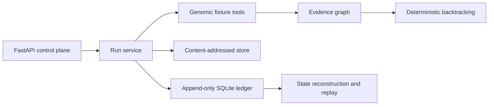
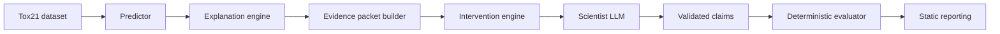

# Architecture

Concordia Colony is a local-first modular monolith. Domain contracts for genomic inputs, run state, evidence graphs, and verification do not depend on the HTTP control plane. The first durable backend slice adds SQLite-backed orchestration around the existing genomic evidence flow while preserving the older molecular research pipeline described below.

The HTTP control plane persists inputs and schedules work without executing the scientific stage in the request process. SQLite events, rather than a mutable run row, are authoritative. The operational jobs table tracks queue state, bounded attempts, cancellation, and expiring leases; it does not replace the event history. A separate local worker claims jobs, heartbeats its lease, resumes stale executions from recorded events, and retries only failures explicitly classified as infrastructure failures.

Each state change is checked before append; event sequence numbers provide optimistic concurrency; and artifact references identify their producing event and tool. Server-Sent Events use sequence numbers as event IDs, accept `Last-Event-ID`, bound each database read, emit idle heartbeats, and close after terminal delivery. The server binds to `127.0.0.1` by default. CellForge execution remains planned.

## Molecular research pipeline

Concordia is organized as a linear, artifact-producing research pipeline. Each boundary has one responsibility and a serializable output. This makes every downstream experiment replayable without silently retraining a model, regenerating an explanation, or retrieving different context.

## Component boundaries

### Predictors

Own molecule validation, featurization, model fitting, prediction, and predictor artifact metadata. The baseline uses Morgan fingerprints and a Random Forest. Predictor outputs contain no scientific interpretation.

### Explanations

Generate model-specific attributions from a frozen predictor. The baseline will use TreeSHAP. Explanations must identify the predicted output being explained, the representation, attribution settings, expected value, feature ordering, and known limits such as fingerprint collisions.

### Evidence

Assemble immutable packets from molecule metadata, predictor output, explanation artifacts, fixed document excerpts, and provenance. Packet serialization must be canonical and content hashed. This boundary prevents live retrieval or changing model outputs from contaminating comparisons.

### Interventions

Apply one deterministic transformation to an evidence packet. An intervention returns a new packet and an audit record identifying its parent, transformation version, parameters, and donor when applicable. It may not alter unrelated fields.

### Scientist

Render a versioned prompt, call one LLM independently for each packet, preserve the raw response, and validate a structured claim contract. It has no memory across conditions, debate roles, or access to control outputs.

The optional tool-enabled extension routes requests through a local, deny-by-default gateway. It is a separate researcher-mode ablation, not part of the packet-only evaluation. The evaluation policy allows zero tools and zero tool calls. Requests and results in researcher mode are typed JSON records; each tool has a versioned handler, bounded calls, and an auditable result hash. Researcher mode may allow deterministic RDKit inspection, but it cannot contribute evidence to the primary MVP comparison. Neither mode permits arbitrary shell or Python execution, network access, retraining, explanation regeneration, cross-packet access, or policy changes.

The bounded session accepts either a typed tool request or a final structured response on each turn. It stops at the policy call limit, records denied and failed calls, and never carries conversation state between experimental conditions.

### Evaluation

Compare control and intervention claims using versioned deterministic rules. Human annotations may be supplied as fixed input for semantic questions that rules cannot answer. Evaluation never calls an LLM, generates a scientific answer, or feeds corrections back to the scientist.

### Reporting

Read manifests and derived metrics to create tables, plots, and a minimal static HTML report. It does not recompute upstream model or LLM outputs.

## Artifact flow

Each stage writes a new artifact rather than modifying an upstream artifact. Manifests include artifact hashes and the code revision. Large artifacts live outside Git; small configurations, schemas, prompts, provenance records, and summary results may be version-controlled.

The first implementation milestone covers the predictor boundary and validated TreeSHAP packet artifacts. The scientist boundary additionally has a local adapter, structured response contract, and content-hashed run records; model qualification and cohort collection remain future work.
